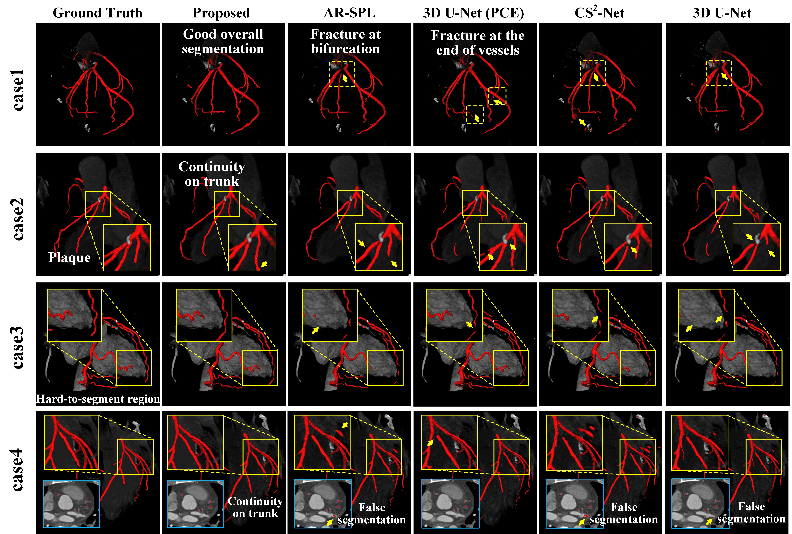
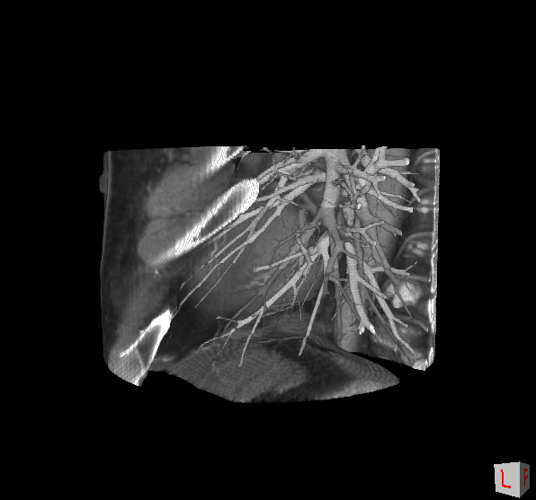
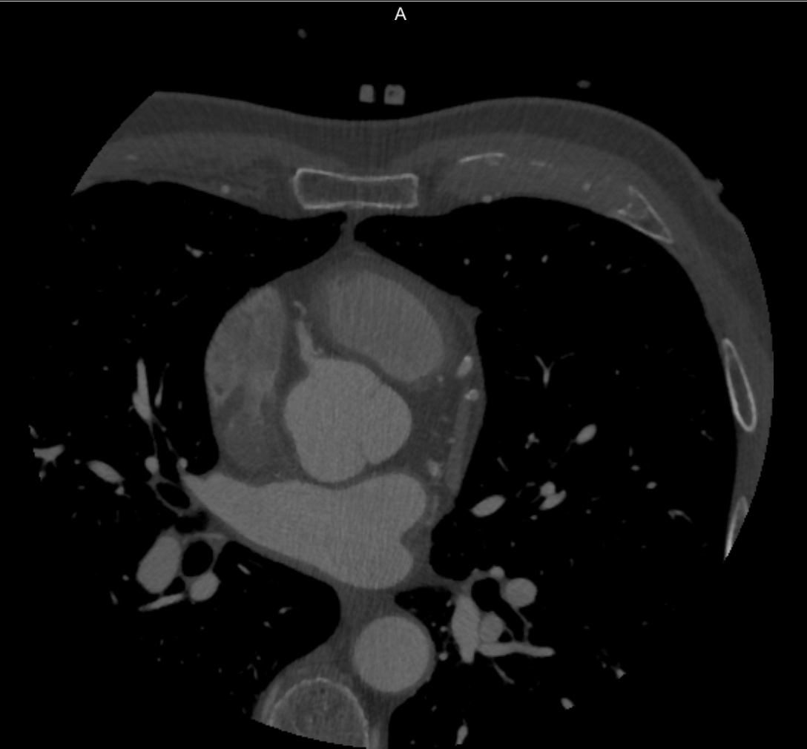

# Examinee-Examiner Network: Weakly Supervised Accurate Coronary Lumen Segmentation using Centerline Constraint

The implementation of Examinee-Examiner Network: Weakly Supervised Accurate Coronary Lumen Segmentation using Centerline Constraint.

## Environment Setup

All the code has been run and tested on  Python 3.7.1, PyTorch 1.6 and numpy 1.16.5, GTX2080Ti GPUs.

## Results presentation

## Data description and preprocessing

### **Cardiac CCTA Data** (Our private dataset)

- Due to privacy issues, the training data cannot be made public at present, but we supplemented the description and the annotation details of the data to facilitate readers to have an objective understanding of our private data set.
- **「Source and acquisition protocols」** **Cardiac CCTA Data** is multi-center and multi-device data. CCTA images from 132 patients whose stenoses were found in the major epicardial coronary arteries by CTA were selected. Two hospitals in China (Shanghai Jiao Tong University Affiliated Sixth People’s Hospital, Shanghai and Beijing Anzhen Hospital, Capital Medical University, Beijing) provided the imaging data. For the data from the first hospital, a 128-slice multidetector CT (Definition AS, Siemens Medical Solutions, Forchheim, Germany) was employed for scanning.
- **「Detailed information」** According to the data of 132 cases used in the experiment, the age of patients ranged from 38 to 83 years old, with an average age of 62.2 years. Among them, there were 99 males and 33 females. In the data, there are 147 lesions of clinical concern, the average quantitative diameter stenosis rate is 45.2%, and the minimum lumen area is 2.13 $mm^2$. Among them, 60 patients had stenosis with a quantitative diameter stenosis rate of more than 50%

### **ASOCA Data** (The public dataset)

- **ASOCA Data** comes from the 2020 MICCAI Challenge "Automated Segmentation of Coronal Arteries". They provided a training data set of 40 CCTA images with contrast agent showing the coronary arteries, comprising 20 healthy patients and 20 patients with confirmed coronary artery disease. The training data set is used in our paper as the test data to verify the generalization ability of our method on the cross-dataset tasks. Annotations produced by three expert annotators are provided for this data set. Data was collected using retrospective ECG-gated acquisition (GE LightSpeed 64 slice CT Scanner, USA. The time point used for the challenge is late diastole (75\% cardiac cycle)
- Download the ASOCA dataset from the official [website](https://asoca.grand-challenge.org/Home/)

### Data preprocessing

- To adapt to the different data types such as DCM, NRRD, etc. and unify the training process, we changed all the data to the RAW type, and the resolution was re-sampled to 1: 1: 1.
- The original image was $512\times512$ per slice, with 200 to 500 slices per image. The region of interest (ROI) was extracted and these heart ROIs were cropped into small 3D patches of $288\times288\times224$ online before been fed into the network due to the limitation of GPU memory.
- The **「Data folder」** contains an original image from ASOCA **「28.nrrd」** and an RAW image **「28.raw」** after our processing. The ROI image after our cutting is provided as a sample, and the size of the image is stored in the **「Npy folder」** as a **「.npy file」**.

- Taking ASOCA data as an example, we first add 1024 uniformly, so that CT values can be converted into gray values for unified processing. Then we use the pre-trained model for predicting the heart region to predict the heart chamber and cut out the ROI region. Here we provide the processed samples **「28.raw」**.
  

## Network

Further content will be announced before the publication

## Training and learning strategy

Further content will be announced before the publication 

## Prediction

Further content will be announced before the publication 